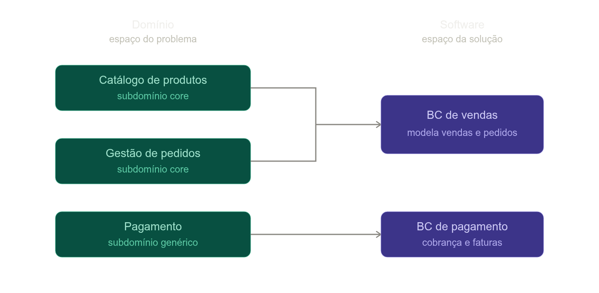

# Diferença entre Bounded Context e SubDomain

Não são a mesma coisa — são dois espaços diferentes, e é por isso que a definição "subdomínio é o problema, Bounded Context é a solução" que você achou está certa.

**Subdomínio** é uma divisão do *problema de negócio*. Você não desenha um subdomínio, você o *descobre* analisando a empresa — "catálogo", "pedidos", "pagamento" existem independente de como o software vai ser feito. Costuma-se classificá-los em core (o diferencial do negócio), suporte e genérico.

**Bounded Context** é uma divisão da *solução*. É uma fronteira em torno de um modelo e de uma linguagem, onde um termo como "Cliente" tem um significado único e consistente. Isso é uma decisão de design, feita pelo time — envolve como vai organizar o código, times, deploy.

O ponto que resolve sua confusão: se Bounded Context *fosse* o subdomínio, a relação entre eles sempre seria 1 para 1. Mas na prática, não é. No diagrama, dois subdomínios (Catálogo e Pedidos) viraram um único Bounded Context ("BC de vendas") — talvez porque, pragmaticamente, fazia sentido modelar e implantar isso junto. Já Pagamento manteve relação 1:1. O contrário também acontece: às vezes um único subdomínio acaba espalhado por mais de um Bounded Context (comum em sistemas legados).

O ideal pregado no DDD é que cada subdomínio vire seu próprio Bounded Context — mas isso é uma meta de design, não uma definição. Por isso vale manter os dois conceitos separados na cabeça: um nasce da análise do negócio, o outro nasce da decisão de como você vai construir o software.

## Porque não fazer ser 1:1?

Ótima pergunta — na real, ninguém te obriga a separar. Você *poderia* chamar tudo de um único subdomínio "Vendas". A questão é que, ao fazer isso, você esconde diferenças que importam pra entender o negócio. O que determina a separação são estes critérios, olhados na análise do problema (não do software):

- **Linguagem diferente**: em Catálogo os termos são produto, categoria, SKU, preço-base. Em Pedidos são carrinho, status, endereço de entrega, forma de pagamento. Poucos termos se sobrepõem — são vocabulários de negócio distintos.
- **Motivo de mudança diferente**: o catálogo muda porque o time de merchandising mexeu em categorização ou preço. Pedidos muda porque a logística mudou uma regra de fulfillment. Coisas que mudam por razões diferentes tendem a ser problemas diferentes.
- **Classificação estratégica diferente**: é bem provável que Pedidos seja seu subdomínio *core* (é onde você compete — talvez entrega rápida seja seu diferencial), enquanto Catálogo seja *genérico* (dá pra comprar um PIM pronto no mercado). Se você funde os dois em "Vendas", perde a capacidade de enxergar isso — e essa distinção é justamente o que ajuda a decidir onde vale investir engenharia própria e onde vale usar solução de prateleira.

Então sim: **a granularidade do subdomínio também é uma escolha de análise**, não uma verdade objetiva esperando ser descoberta. Analistas diferentes podem traçar a linha em lugares ligeiramente diferentes. Mas isso não anula a distinção problema/solução — a escolha aqui ainda é sobre *entender o negócio* (onde a complexidade e o valor estratégico se concentram), enquanto a escolha do Bounded Context é sobre *como construir o software*.

E olha só o efeito prático disso: mesmo que você decidisse tratar tudo como um único subdomínio "Vendas", nada te impede de ainda assim implementar em dois Bounded Contexts separados (por exemplo, por razão técnica de escala — busca de catálogo tem padrão de leitura muito diferente de processamento de pedido). É exatamente esse tipo de independência entre as duas decisões que mostra que elas não são a mesma coisa.
