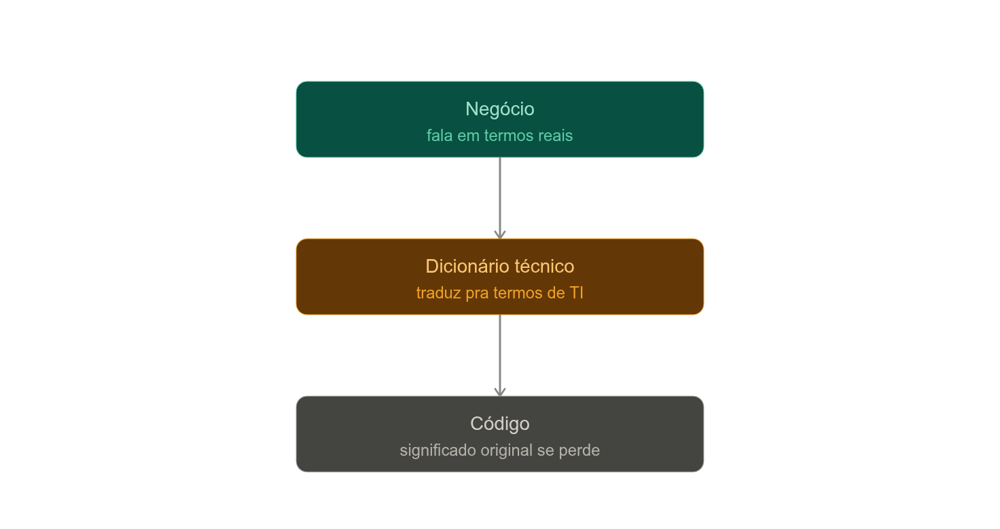
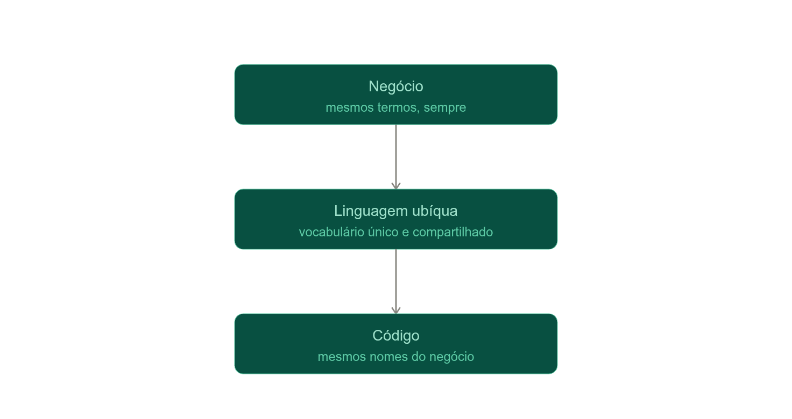

# Linguagem Ubíqua

A Linguagem Ubíqua é o vocabulário único, compartilhado por todo mundo envolvido num Bounded Context — especialistas de negócio, desenvolvedores, QA, product — e que aparece em todo lugar: nas conversas, na documentação, nos diagramas e, principalmente, **no próprio código** (nomes de classe, método, variável). Ela é precisa (elimina ambiguidade que a fala natural tolera), local a um contexto (o mesmo termo pode significar outra coisa em outro BC, sem problema) e viva — evolui junto com o entendimento do domínio, através de conversa contínua entre quem entende do negócio e quem escreve o código.

A sua analogia do Google Tradutor é exatamente o motivo de evitar "dicionários" de tradução entre negócio e software. Pensa no fluxo comum sem linguagem ubíqua: o especialista descreve uma regra em termos de negócio, um analista traduz isso pra "requisitos técnicos", o desenvolvedor traduz de novo pra classes e métodos genéricos. Cada seta é uma tradução — e, como no round-trip do tradutor, cada camada perde nuance e introduz distorção.

E tem um segundo problema, além da perda de nuance: o "dicionário" fica **desatualizado**. O negócio evolui, o código evolui, e o mapeamento entre os dois não acompanha — ninguém lembra de manter a tradução em dia. Meses depois, uma classe chamada `updateFlag()` não tem mais nenhuma relação clara com a regra de negócio que ela implementa, e só quem "sabe o segredo" consegue fazer a ponte de volta.

Com Linguagem Ubíqua, essa etapa de tradução simplesmente não existe — o mesmo termo é usado dos dois lados, sem intermediário:

A mesma cor nas três caixas é o ponto: não é uma tradução em etapas, é um vocabulário só, usado sem alteração do início ao fim. E há um terceiro ganho, além de evitar perda e desatualização: **ambiguidades ficam visíveis mais cedo**. Se dentro de um mesmo contexto um termo tem dois sentidos diferentes, isso vira um problema de modelagem que precisa ser resolvido — geralmente sinal de que aquele "contexto" na verdade deveria virar dois Bounded Contexts. Um dicionário, ao invés disso, "resolve" mapeando qualquer coisa pra qualquer coisa e esconde o problema em vez de expor.

## **O que ela não é:**

- **Não é a fala natural do dia a dia, sem rigor.** Se o negócio usa "cliente" ambiguamente pra duas coisas diferentes, a linguagem ubíqua força a diferenciação explícita (ex: "comprador" vs "titular da conta") — ela é mais precisa que a conversa cotidiana, não uma cópia dela.
- **Não é um glossário estático guardado num documento.** Não é um PDF de definições arquivado que ninguém mais lê. Ela vive nas conversas em andamento e, sobretudo, no código atual — se o código não reflete o termo, o glossário mentiu.
- **Não é jargão técnico imposto ao negócio.** A direção é o contrário: é o código que adota os termos do domínio, não o especialista de negócio que aprende a falar em "Manager", "Handler", "DTO".
- **Não é única pra empresa inteira.** Não existe uma linguagem ubíqua "global" — tentar criar um dicionário único pra todos os contextos da organização é recriar o mesmo problema de tradução com perda, só que dentro do próprio negócio, entre departamentos diferentes.
- **Não é decidida numa reunião e congelada.** Ela é revisitada sempre que a conversa revela que um termo não serve mais ou esconde uma distinção importante.
- **Não é sinônimo de convenção de nomenclatura técnica.** camelCase, nome de tabela, nome de endpoint — essas são decisões de estilo de código. A linguagem ubíqua nasce da conversa sobre o domínio; a convenção técnica é só como ela é escrita.
