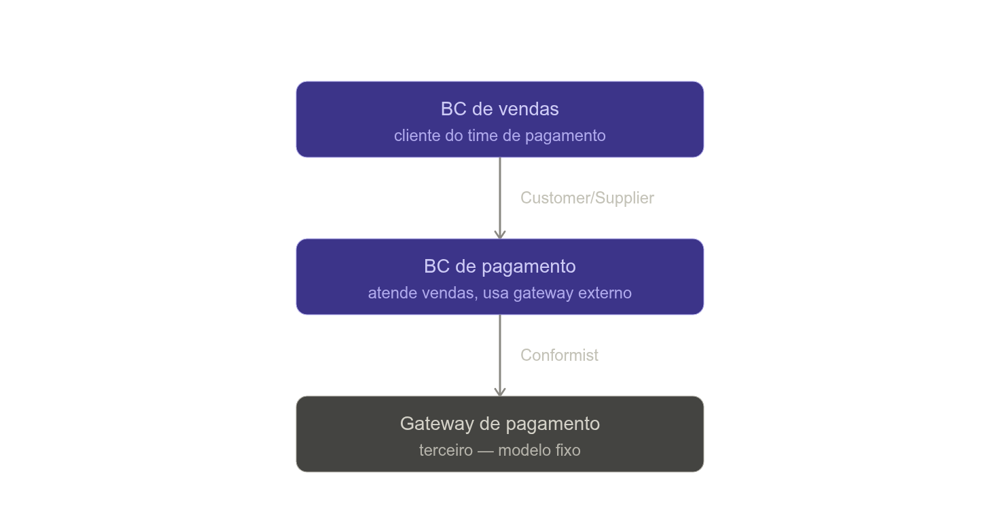

# Context Map

**O que é**

Context Map é o "mapa-múndi" dos Bounded Contexts do seu sistema: um artefato (normalmente um diagrama, mas fundamentalmente um entendimento compartilhado) que mostra quais contextos existem e, principalmente, **como eles se relacionam** entre si. Pra cada par de contextos que troca informação, o Context Map registra:

- **A direção da dependência** — quem é *upstream* (dita o modelo/API) e quem é *downstream* (precisa se adaptar).
- **O padrão de integração usado** entre eles. Os principais:
  - **Partnership** — dois times avançam juntos, sucesso ou fracasso é compartilhado, sem hierarquia upstream/downstream.
  - **Shared Kernel** — um pedacinho pequeno de modelo/código é explicitamente compartilhado entre dois contextos (usar com moderação, exige coordenação apertada).
  - **Customer/Supplier** — o downstream é "cliente"; o time upstream se compromete a atender as necessidades dele no roadmap.
  - **Conformist** — o downstream simplesmente aceita o modelo do upstream como está, sem poder de negociação (comum ao integrar com um serviço de terceiro).
  - **Anticorruption Layer** — o downstream constrói uma camada de tradução pra se proteger do modelo do upstream (isso a gente já viu, no exemplo Catálogo → Pedidos).
  - **Open Host Service + Published Language** — o upstream publica uma API estável e documentada, pensada pra vários consumidores de uma vez, em vez de integração ad hoc.
  - **Separate Ways** — decisão consciente de *não* integrar; duplicar uma funcionalidade pequena sai mais barato que construir a ponte.

**Por que evitar a "grande bola de lama"**

Big Ball of Mud é o que acontece por padrão, sem esforço nenhum, quando ninguém traça fronteira nenhuma: tudo referencia tudo, qualquer classe pode ser importada de qualquer lugar, uma mudança num canto quebra algo em outro sem aviso, e o mesmo termo acumula significados conflitantes com o tempo (o oposto de tudo que a linguagem ubíqua tenta proteger). É o caminho de menor resistência — não é preciso fazer nada de errado especificamente, só não decidir onde ficam os limites.

O Context Map evita isso porque torna as fronteiras e o acoplamento **explícitos e deliberados**, em vez de acidentais. Ele não elimina acoplamento — sistemas reais precisam se comunicar — mas transforma "alguém importou uma entidade interna de outro módulo porque estava ali" em "esse acoplamento existe, tem nome, foi uma escolha, e o time sabe o preço dela". Ele também expõe relações de poder entre times (quem dita o modelo, quem se adapta), o que é importante numa organização com vários times — reflete a Lei de Conway: a estrutura do seu software tende a espelhar a estrutura de comunicação dos times que o constroem.

**Como criar um Context Map**

1. Liste todos os Bounded Contexts que já existem (ou que vão existir) — isso vem do trabalho anterior de identificar subdomínios e desenhar as fronteiras de código.
2. Pra cada par que troca informação, negocie e registre: quem é upstream, quem é downstream, e qual padrão da lista acima descreve a relação. Isso costuma ser feito em conjunto com quem lidera cada contexto — não é uma decisão de uma pessoa só, é acordo entre times.
3. Desenhe: caixas pros contextos, setas pra dependência, e o nome do padrão em cada seta.
4. Comece mapeando o estado **atual**, mesmo que bagunçado — inclusive relações dolorosas (tipo um Conformist que ninguém queria). É isso que revela onde estão os problemas reais antes de tentar consertar.
5. Trate como vivo, não congelado — revisite sempre que uma nova integração aparecer ou uma relação for renegociada.

Repara: Vendas é upstream em relação a Pagamento (dita a necessidade), mas Pagamento vira downstream do Gateway externo (aceita o modelo dele sem poder negociar — é um serviço de terceiro). Um mesmo contexto pode ser upstream numa relação e downstream em outra, ao mesmo tempo.

## **O que ele não é**

- **Não é um diagrama de infraestrutura.** Não mostra servidores, filas, containers — mostra relações entre *modelos*, mesmo que a infra depois materialize essas relações.
- **Não é um ERD de banco de dados.** Não mapeia tabelas; mapeia contextos e o tipo de acoplamento entre eles.
- **Não é a mesma coisa que definir os Bounded Contexts.** O Context Map pressupõe que os contextos já foram identificados (trabalho estratégico anterior); ele mapeia as relações *entre* eles, não decide onde cada um começa e termina.
- **Não é um documento desenhado uma vez e arquivado.** Como a linguagem ubíqua, se ele não acompanha a realidade atual das integrações, vira decoração desatualizada — o mesmo problema do "dicionário" que já vimos.
- **Não é uma garantia técnica.** O diagrama sozinho não impede fisicamente alguém de importar uma classe interna de outro contexto — isso ainda exige disciplina de time, módulos separados, code review. O Context Map só torna a decisão visível e força que seja consciente.
- **Não é puramente técnico.** Tem uma dimensão organizacional forte — como ele nomeia relações de poder entre times (quem dita o modelo, quem se adapta), negociar um Context Map muitas vezes é negociar como os times vão trabalhar juntos, não só como o código vai se comunicar.
- **Não precisa ser um diagrama único e gigante.** Em sistemas grandes, um mapa monolítico com dezenas de contextos fica ilegível — é comum ter visões parciais por área, e juntar tudo só quando necessário.
