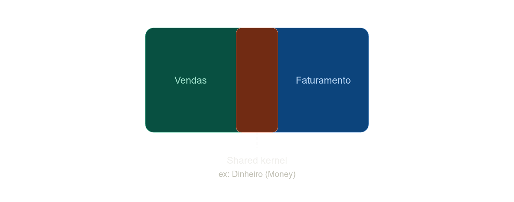

# Shared Kernel

Shared Kernel é quando dois Bounded Contexts concordam em compartilhar explicitamente um subconjunto pequeno do modelo de domínio (e a implementação dele) — em vez de cada um ter sua própria versão traduzida, como no exemplo do Anticorruption Layer que vimos antes. Exemplo clássico: "Vendas" e "Faturamento" podem compartilhar um mesmo Value Object `Dinheiro` (com as mesmas regras de arredondamento) porque seria perigoso ter duas implementações levemente diferentes de algo tão sensível a divergência.

## **Por que a presença dele importa**

Ele existe porque a estratégia padrão do DDD (cada contexto com modelo independente, comunicando via tradução/ACL) tem um custo — duplicar e traduzir sempre. Pra a maioria dos conceitos, esse custo vale a pena, porque compra autonomia. Mas, ocasionalmente, existe um conceito tão central e tão sensível a inconsistência entre dois times próximos que o custo de manter duas versões traduzidas é maior que o custo do acoplamento. Shared Kernel é essa válvula de escape — mas **conscientemente escolhida**, com um nome, um dono, e comunicação constante entre os dois times, porque qualquer mudança ali afeta os dois lados ao mesmo tempo.

## **O que ele não é**

- **Não é um Bounded Context nem um Subdomínio.** É uma relação *entre* dois contextos já existentes — não uma terceira unidade estratégica.
- **Não é uma pasta de utilitários técnicos genéricos compartilhada por todos os contextos.** Isso é outra coisa (falo mais sobre isso já já).
- **Não é a estratégia padrão de integração.** É a exceção deliberada — o padrão default em DDD é modelos independentes com tradução na borda (ACL). Shared Kernel só entra quando o custo da tradução supera o custo do acoplamento.
- **Não deve crescer sem limite.** Se o "shared kernel" vai inchando até virar o coração do sistema, os dois contextos deixaram de ser realmente independentes — sinal de que talvez devessem ser um único BC, ou que a fronteira foi mal traçada.
- **Não é decisão de um time só.** Como o código é literalmente compartilhado, qualquer mudança exige coordenação constante com o outro time dono.
- **Não é uma forma de evitar fazer tradução/ACL.** É o oposto: você só usa quando aceita conscientemente *não* traduzir aquele pedaço específico.

## **Sobre a sua estrutura de pastas**

Aqui vai a correção principal: o que você montou não é, tecnicamente, um Shared Kernel no sentido do DDD — mesmo sendo um padrão de arquitetura totalmente legítimo e comum. `Entity<T>`, `Repository<T>` são **andaimes técnicos genéricos** (building blocks táticos), não conceitos de *domínio*. Shared Kernel, no sentido estratégico, é sobre compartilhar um pedaço do *modelo de negócio* entre dois contextos específicos — algo como um `Dinheiro` ou `Endereço` compartilhado entre Vendas e Faturamento, carregando linguagem ubíqua real.

O que você tem é geralmente chamado de outra coisa — `Common/`, `BuildingBlocks/`, `Kernel.Tecnico/` — uma biblioteca de infraestrutura genérica que todo BC usa, sem carregar nenhum conceito de negócio específico. Isso é ótimo e comum, só não é o padrão estratégico "Shared Kernel" da Context Map — é uma preocupação tática/técnica, ortogonal a essa discussão.

A diferença prática importa porque muda a expectativa de acoplamento: sua pasta técnica pode evoluir livremente sem exigir negociação entre times de domínios diferentes (afinal, `Entity<T>` não carrega regra de negócio nenhuma). Já um Shared Kernel de verdade — se um dia dois dos seus BCs precisarem compartilhar algo como um Value Object de domínio — exigiria esse acordo explícito entre os dois times donos, e provavelmente viveria numa pasta própria, referenciada só por esses dois contextos, não por todos.
